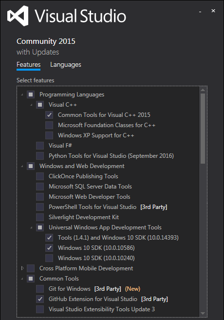

# Środowisko

## Komputer

Widziałem komputer służący do kompilacji programów, który miał 128 gigbajtów pamięci i kilka procesorów XEON. Widziałem program \(system\), który kompilował się na tym potworze kilka godzin. Czasem słaby laptop może nie wystarczyć.

Nie ma potrzeby zaczynać od jakiegoś superkomputera, ale:
* wydajny dysk znakomicie przyspiesza naukę - w czasie kompilacji nawet małego programu kompilator odczytuje i zapisuje setki plików.
* kompilator zużywa trochę pamięci, większość kompilatorów dobrze wykorzystuje wiele rdzeni i procesorów, ale nie ma sensu przesadzać, to nie musi być komputer dla gracza.

Przykładowe [minimalne wymagania](https://www.visualstudio.com/en-us/productinfo/vs2015-sysrequirements-vs) dla Visual Studio \(one są naprawdę minimalne a nie komfortowe\):
- procesor 1.6 GHz
- 1 GB pamięci RAM
- 4 GB wolnego miejsca na dysku
- dysk twardy o prędkości obrotowej 5400 RPM
- karta graficzna 1024×768, zgodna z DirectX
- Windows 7

## Kompilator

Dostępnych, aktualnych i rozwijanych kompilatorów języka C++ jest na rynku ... kilkadziesiąt, może więcej. Różnią się dostępnością \(komercyjne, darmowe, darmowe warunkowo\), platformą na której działają i platformą dla której tworzą programy.

Spośród kompilatorów działających na komputerach osobistych \(Windows, Linux, MacOS\), tworzących programy dla komputerów osobistych warto wspomnieć o:
- **Visual C++**, wchodzący w skład Visual Studio. Działa pod kontrolą systemu Windows, wspiera C++14 i częściowo C++17, produkt komercyjny, ma wersje dostępne za darmo \(dla małych firm - edycja Express, dla społeczności Open Source - edycja Community\), znakomity. Przy pomocy Visual C++ jest skompilowany cały system Windows.
- **gcc/g++** - rewelacyjny kompilator i kompilator skrośny, przede wszystkim dla Linuxa, wspiera C++14 i C++17, wprowadza rozszerzenia inspirujące powstawanie kolejnych wersji języka. Przy pomocy gcc jest skompilowany cały system Linux. Wersja gcc dla Windows to MinGW, raczej niszowa. Dostępny na licencji GPL i LGPL \(najgorsza możliwa licencja, wymysł diabła, [jeszcze o tym będzie](../_placeholder_.md)\).
- **clang \(LLVM\)** - kolejny świetny kompilator, stoi za nim Apple. Konkuruje z gcc \(w wielu zastosowaniach można użyć clanga wymiennie z gcc\), motywacją napisania clanga była potrzeba stworzenia kompilatora na licencji liberalnej \(BSD\). Wspiera C++14, C++17 i podobnie jak gcc wprowadza rozszerzenia inspirujące powstawanie kolejnych wersji języka. Wersja dla Windows raczej nie działa, plotka głosi, że Microsoft planuje migrację do clanga \(któraś kolejna wersja Windows ma być skompilowana clangiem\).

## Środowisko zintegrowane \(IDE\)

Można programy pisać w notepadzie albo vi i kompilować z linii poleceń. Można furmanką pojechać do Paryża, tylko po co? Przemyślane, dobrze skonfigurowane zintegrowane środowisko projektowe znakomicie odciąża programistę, nie trzeba dbać o drobiazgi, zapewnia harmonijną współpracę dobrego edytora, kompilatora, środowiska uruchomieniowego \(debuggera czyli odpluskwiacza, będzie o nim więcej\) i kilku innych narzędzi. Po to ludzkość wymyśliła komputery, żeby pracowały za nas i żebyśmy mogli skoncentrować się na pracy.

- Dla Windows nie ma lepszego środowiska niż **Visual Studio**. Wszystkie programy dołączone do niniejszego kursu są przygotowane jako projekty Visual Studio.
- Godnym zainteresowania darmowym środowiskiem, zarówno dla Linuxa, jak i dla Windows jest [Eclipse](https://eclipse.org/). Zaletą jest dobre wsparcie dla moich ulubionych języków \(można używać w jednym projekcie C++, Javę i Perl\) i fakt, że w wersji dla Windows debugger działa poprawnie \(a to nie jest powszechna właściwość\). Poważną wadą jest nieintuicyjny interfejs. Aby używać Eclipse i C++ potrzebny jest plugin/wersja CDT.

### Visual Studio

[Visual Studio](https://www.visualstudio.com/) jest dostępne w kilku edycjach: Express, Community, Standard, Professional, Enterprise, zawiera MSDN albo nie zawiera, ...
Edycje Express i Community są darmowe. Express jest bardzo ograniczona funkcjonalnie, ale można ją wykorzystywać do celów komercyjnych.
Community ma te same funkcje co Professional \(nigdy nie potrzebowałem nic więcej\), ale nie można nią zarobkować.
Dla  wykonania ćwiczeń z tego kursu najlepszym wyborem jest wersja Community.

Dygresja o numerach wersji: Microsoft prowadzi [dwie numeracje wersji](https://pl.wikipedia.org/wiki/Microsoft_Visual_Studio):
- marketingowa: rok wydania.
- techniczna: realny numer wersji.
Numeracja zrównała się w roku 2010 - Visual Studio 2010 miało numer wersji 10.
Aktualna stabilna wersja: Visual Studio 2015, wersja 14.
W przygotowaniu: Visual Studio 2017, wersja 15. Będzie mieć pełne wsparcie dla C++17 :)

---

Do pobrania: https://go.microsoft.com/fwlink/?LinkId=691978&clcid=0x409

Instalacja może potrwać kilka godzin, skonsumuje kilka gigabajtów danych z sieci, spowoduje stratę kilku gigabajtów dysku.
Parametry standardowej instalacji VS nie są dopasowane do projektowania w C++.

Należy zainstalować:
- Programming languages
  - Visual C++
    - **Common Tools for Visual C++ 2015**
- Windows and Web development
  - Universal Windows App Development Tools
    - **Tools and Windows SDK**
    - **Windows 10 SDK**
- Common Tools
  - **Github Extension for Visual Studio**

