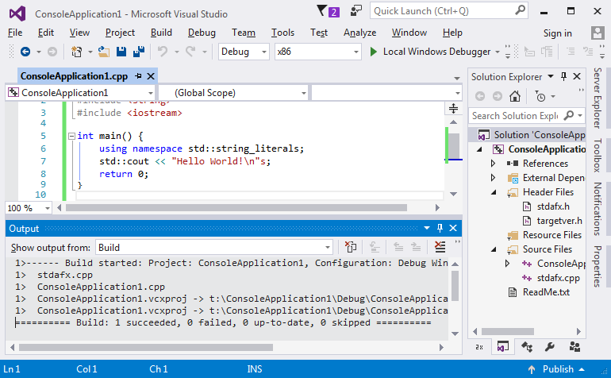

# Hello world

## Coliru

Prawie wszystkie kody z kursu dostępne są też na platformie Coliru. Programy można edytować, kompilować (gcc albo clang), uruchamiać z przeglądarki, nie jest potrzebny lokalnie zainstalowany kompilator. Coliru używa potężnego edytora ace [(spis skrótów klawiaturowych)](https://github.com/ajaxorg/ace/wiki/Default-Keyboard-Shortcuts).

Kod [Hello world]((http://coliru.stacked-crooked.com/a/be1a932a974e7b6f) na Coliru.

## GitHub

Treść kursu oraz źródła programów są dostępne na [githubie](https://github.com/jbanaszczyk/CppTraining). Na razie (przed "[Wprowadzenie do gita](../_placeholder_.md)"): należy: kliknąć "Clone or download" » Download ZIP » i otworzyć w Visual Studio właściwy plik \*.sln.

## Najprostszy program

Stałą praktyką w nauczaniu tworzenia oprogramowania jest demonstracja najprostszego programu w danym języku tak, aby można było jak najszybciej do teorii dołączyć umiejętności praktyczne.

Podobny opis [zamieścił Microsoft](https://www.visualstudio.com/vs/support/#!articles/816-6458-hello-world-in-c-using-visual-studio-2015).

## Reset ustawień Visual Studio

Na wszelki wypadek, gdy eksperymenty z Visual Studio zabrną za daleko, warto wspomnieć o:

- Przywrócenie standardowych ustawień okienek:
> Menu: Window » Reset Window Layout
- Przywrócenie defaultowych ustawień wszystkich opcji:
> Menu: Tools » Import and Export Settings » Reset all settings

## Nowy projekt:
> Skrót: Ctrl-Shift-N  
> Menu: File » New » Project
> > Rodzaj projektu: Templates » Visual C++ » Win32  
> > Szablon projektu: Win32 Console Application


---

Ten typ projektu nie ma zbyt wielu parametrów, standardowe wartości są bardzo dobre. Można wybrać "Finish".


## Projekt "Hello world"

Najprostszy projekt w w Visual Studio w C++ wygląda tak:


Minimalne wymagania wobec komputera dla VS mówią o karcie graficznej co najmniej 1024×768, GitBook skaluje obrazki do szerokości max. 770px, to wygląda jak wygląda :(

Program robi nic, należy go zastąpić kodem (plik ConsoleApplication1.cpp):
```C++
#include "stdafx.h"
#include <string>
#include <iostream>

int main() {
	using namespace std::string_literals;
	std::cout << "Hello World!\n"s;
	return 0;
}
```
Ten kod:
* Powinien wypisać na konsoli napis "Hello World!" i przejść do nowej linii.
* Jest napisany w czystym C++.
* Wymaga kompilatora co najmniej C++14.
* Dla purystów: tu jest jeden błąd, mało istotny (tak, są sytuacje, kiedy wykonanie programu nie powiedzie się).

## Kompilacja

Stale powtarzaną czynnością jest budowanie projektu (na razie niech wystarczy: przetworzenie napisanego kodu na kod binarny).
> Skrót: Ctrl-Shift-B  
> Skrót: F7 (zależnie od ustawień VS)  
> Menu: Build » Build Solution  
> Menu kontekstowe w Solution Explorer: Build Solution

W logu w oknie "Output" powinien się pojawić opis "gdzie powstał program":
> ConsoleApplication1.vcxproj -> t:\ConsoleApplication1\Debug\ConsoleApplication1.exe

oraz podsumowanie procesu:
> ========== Build: 1 succeeded, 0 failed, 0 up-to-date, 0 skipped ==========



## Uruchomienie

Program można uruchomić korzystając z debuggera. Debugger to potężne narzędzie, pozwala na kontrolowane wykonania programu (linia po linii, zaglądając do ciała funkcji, z ustawianiem punktów przerwania), monitorowaniem stanu (podglądanie i zmiana zwartości obiektów), lokalnie albo zdalnie, z możliwością "podłączenia się" do działającego procesu i dziesiątkami innych funkcji.

W ostatniej linii kodu ```}``` należy ustawić punkt przerwania (czerwony znacznik na marginesie)
> Skrót: F9  
> Menu: Debug » Toggle Breakpoint  
> Menu kontekstowe w Edytorze: Breakpoint » Insert Breakpoint

i uruchomić program - będzie się wykonywać do końca albo do punktu przerwania:
> Skrót: F5  
> Menu: Debug » Start Debugging


### Zakończenie działania programu

* Eleganckie (niech wykona się do końca):
> Skrót: F5  
> Menu: Debug » Continue

* Brutalne (po prostu koniec):
> Skrót: Shift-F5  
> Menu: Debug » Stop Debugging

## O czym był ten program?

Aby nie pozostawiać niedomówień opiszę tych kilka linii. Temat z każdego zdania zostanie wkrótce omówiony, teraz może być czarną magią:

* ```#include "stdafx.h"```  
   Wykorzystanie wstępnie kompilowanych nagłówków. Pliki nagłówkowe to jeden z bardziej nieudanych elementów języka, będzie usprawniony przez moduły (wprowadzone w C++17). Wstępnie kompilowane nagłówki (precompiled headers) znakomicie przyspieszają proces kompilacji, zostały wprowadzone w każdym szanującym się kompilatorze, w każdym inaczej. Tu: wersja Visual Studio.
* ```#include <string>```  
   Włączenie wsparcia dla klasy ```std::string``` - chodzi o to, żeby kompilator rozumiał napisy.
* ```#include <iostream>```  
   Włączenie wsparcia dla operacji wejścia/wyjścia na strumieniach - niech nasz program potrafi coś napisać na konsoli.
* ```<pusta linia>```  
  C++ w zasadzie nie zwraca uwagi na formatowanie. Formatowanie ma sprzyjać czytelności kodu. Kompilator (zazwyczaj) puste linie po prostu ignoruje.
* ```int main() {```  
  Tu jest dużo treści:
  * Program definiuje funkcję ```main```. Funkcja nie ma argumentów - puste nawiasy ```main()``` i zwraca wynik: liczba całkowita ze ze znakiem ```int```.
  * Otwierający nawias klamrowy ```{``` oznacza, że w kolejnych liniach będzie definiowana treść funkcji.
  * Przyjęło się (to jest konwencja, a nie definicja języka), że jeżeli program jest uruchamiany przez system operacyjny (Windows, Linux, Unix, etc.), to zaczyna od funkcji main.
* ```using namespace std::string_literals;```  
   * Formalnie: w ramach funkcji ```main()``` wprowadzamy operator ```""s``` na literałach tekstowych (literały to wartości zapisane literalnie, na przykład 1500, 3.14 albo "Hello World!\n"). Chodzi o to, aby w kolejnej linii napis "CosTam"s (z 's' na końcu) został potraktowany jako obiekt klasy ```std::string``` a nie jak starożytna tablica znaków, rodem z języka C.
* ```std::cout << "Hello World!\n"s;```  
   * Na standardowym strumieniu wyjściowym, zazwyczaj związanym z konsolą ```std::cout``` powinien pojawić się napis "Hello World!\n".
   * ```"Hello World!\n"s``` jest obiektem klasy ```std::string```
   * ```"\n"``` jest interpretowany jako znak przejścia do nowej linii.
   * ```<<``` jest operatorem. Takim jak plus czy minus.
* ```return 0;```  
   * ```return``` oznacza zakończenie działania funkcji, w tym wypadku funkcji main().
   * ```return 0;``` zwraca wynik funkcji ```0``` (literał). Typ wyniku ```int``` jest zgodny z deklaracją typu funkcji ```int main()```
   * (konwencja) wartość ```0``` zwrócona systemowi operacyjnymi oznacza "wszystko ok".
* ```}```  
   Domknięcie nawiasu klamrowego (z linii ```int main() {```). Bo nawiasy muszą się zgadzać.

# Wykonaj to własnoręcznie

Celem ćwiczenia jest pobieżne zaznajomienie się ze środowiskiem Visual Studio. Podobne koncepty można spotkać w większości IDE:
- skutkiem przetworzenia (kompilacji itd) jednego projektu jest jeden artefakt taki jak:
  - plik wykonywalny (na platformie Windows to plik exe),
  - biblioteka przeznaczona do wykorzystania w projekcie (lib),
  - biblioteka dołączana w czasie wykonania (dll, so) itp,
- projekty są pogrupowane w rozwiązania (Visual Studio: solution),
  - można tworzyć bardziej rozbudowane hierarchie projektów (rozwiązanie zawiera projekty, które zawierają projekty, ... - ma to sens w przypadku naprawdę dużych projektów)
- środowisko ułatwia zarządzanie opcjami wpływającymi na proces budowania projektów (kompilacji itp).
  - środowisko ułatwia wybór grup opcji - na przykład szybka kompilacja dla celów uruchomieniowych (debug) vs. kompilacja z silną optymalizacją kodu finalnego (release).
- środowisko dba o to, by zużycie zasobów związane z kompilacją było jak najmniejsze (nie ma potrzeby kompilować plików, które nie uległy zmianie),
- edytor tekstu zapewnia wsparcie dla programisty:
  - wspomaga dopasowanie nawiasów, 
  - kolor i inne atrybuty tekstu mają związek ze składnią języka,
  - na bieżąco wykrywa proste błędy,
  - podpowiada nazwy identyfikatorów w czasie pisania.   

## Projekt z dwoma programami

Należy założyć nowy, pusty projekt, nazwany myFirstSolution 
> Rodzaj projektu: Templates » Other Project Types » Visual Studio Solutions  
> Szablon projektu: Blank Solution  
> Nazwa: myFirstSolution

W *myFirstSolution* należy założyć dwa projekty C++ o nazwach App1 i App2
> menu kontekstowe Solution Explorera: Add » New Project
> > Rodzaj projektu: Templates » Visual C++ » Win32  
> > Szablon projektu: Win32 Console Application  
> Nazwa: odpowiednio App1 i App2

W każdym z projektów należy utworzyć nowy plik myFunc.h (efektywnie: to będą dwa różne pliki, o takich samych nazwach, ale w różnych katalogach):
> menu kontekstowe sekcji "Header Files":
> > Add » New Item
> > > Type: Visual C++ » Header File (.h)  
> > > Nazwa: myFunc.h

Zawartość pliku myFunc.h (w obu projektach taka sama)
```C++
#pragma once

#include <string>

std::string myFunc();
```

W każdym z projektów należy utworzyć nowy plik myFunc.cpp (analogicznie: to będą dwa różne pliki, o takich samych nazwach, ale w różnych katalogach):
> menu kontekstowe sekcji "Source Files":
> > Add » New Item
> > > Type: Visual C++ » C++ File (.cpp)  
> > > Nazwa: myFunc.cpp

Zawartość pliku myFunc.cpp w projekcie App1
```C++
#include "stdafx.h"
#include "myFunc.h"
#include <string>

std::string myFunc() {
	using namespace std::string_literals;
	return "Hello World from App1"s;
}
```

Zawartość pliku myFunc.cpp w projekcie App2 (różni się tylko literałem przy instrukcji ```return```)
```C++
#include "stdafx.h"
#include "myFunc.h"
#include <string>

std::string myFunc() {
	using namespace std::string_literals;
	return "Hello World from App2"s;
}
```

W każdym z projektów plik zawierający funkcję main() (odpowiednio App1.cpp i App2.cpp) powinien być taki sam i zawierać:
```C++
#include "stdafx.h"
#include "myFunc.h"
#include <string>
#include <iostream>

int main() {
	using namespace std::string_literals;
	std::cout << myFunc() << "\n"s;
	return 0;
}
```

### Solution Explorer

Projekt powinien wyglądać tak (z dokładnością do ikon przed nazwami plików):


### Kompilacja

Projekt powinien dać się skompilować bez problemu (ważna jest ostatnia linia: ..., 0 failed, ...):
> Skrót: Ctrl-Shift-B  
> Menu: ... miliony kliknięć, kilometry myszką, podstawowych skrótów klawiaturowych trzeba się nauczyć.


### Uruchomienie

Program po uruchomieniu:
> Skrót: Ctr-F5  
> Menu: Debug » Start Without Debugging

 
 ## Przełączanie między projektami

Należy zmienić projekt początkowy (ten który jest uruchamiany poleceniami "Start Debugging" / "Start Without Debugging").
> Solution Explorer: menu kontekstowe drugiego projektu: Set as StartUp Project

i uruchomić:
> Skrót: Ctr-F5


### Kolejność budowania projektów

W tym przypadku projekty App1 i App2 są od siebie niezależne, kolejność ich budowania nie ma żadnego znaczenia.

Gdyby projekty od siebie zależały (na przykład App2 zawierałby bibliotekę używaną przez App1):
> Solution Explorer: menu kontekstowe całego rozwiązania: Project Build Order

## Build, rebuild, compile

Proces budowania jest procesem kosztownym - wymaga przeczytania wielu dziesiątek plików, realizacji skomplikowanych algorytmów, zapisania kilku plików.

W zasadzie wszystkie kompilatory (nie tylko C++) korzystają ze spostrzeżenia: jeśli plik źródłowy nie uległ zmianie, ani nie uległ zmianie żaden z plików, od których zależy wynik kompilacji (biblioteki, pliki dołączone (za chwilę będzie o preprocesorze)), ani opcje kompilacji nie uległy zmianie, to nie ma żadnej potrzeby ponownego kompilowania kodu.

### Build, rebuild

Należy kilkukrotnie uruchomić "Build project", "Rebuild project" i obserwować działania Visual Studio.  
Należy modyfikować zawartość plików myFunc.h i App1.cpp (dodając spację na końcu pliku i zapisując plik na dysku), kilkukrotnie uruchomić "Build project", "Rebuild project" i obserwować działania Visual Studio.

* "Build" buduje projekt najmniejszym wysiłkiem - nie kompiluje modułów, które nie uległy zmianie.
* "Rebuild" bezwarunkowo kompiluje cały projekt.

## O czym był ten program?

### Jednostki kompilacji, linkowanie 

Projekty App1 i App2 są takie same, będzie omówiony tylko jeden.

Projekt App1 zawiera dwie, w zasadzie niezależne jednostki kompilacji (ang: compilation unit): "myFunc.cpp" i "App1.cpp". Obie są kompilowane, skutkiem ich kompilacji jest plik pośredni z rozszerzeniem \*.obj (ang: object file). Object file zawiera, oprócz kodu wynikowego, mnóstwo informacji które będą wykorzystane w kolejnym etapie: linkowaniu.

```
+------------+         +------------+
| myFunc.cpp |         |  App1.cpp  |
+-----v------+         +-----v------+
      |                      |
+-----V------+         +-----V------+
| myFunc.obj |         |  App1.obj  |
+------------+         +------------+
```

Ostatnim etapem budowania pliku wykonywalnego jest połączenie plików \*.obj ze wszystkich jednostek kompilacji, dołożenie pożądanych bibliotek (biblioteka to nic innego, jak wiele plików \*.obj spakowanych w jedną całość) i wygenerowanie pliku wykonywalnego oczekiwanego przez system.

```C++
+------------+         +------------+         +------------+
| myFunc.obj |         |  App1.obj  |         |   libc++   |
+-----v------+         +-----v------+         +-----v------+
      |                      |                      |
      +------------+         |         +------------+
                   |         |         |
+------------------V---------V---------V-------------------+
|                         App1.exe                         |
+----------------------------------------------------------+
```

Linker dopasowuje odpowiednie symbole:
* wywołanie funkcji ```myFunc()``` z App1 jest zastąpione wywołaniem realnej funkcji ```std::string myFunc()``` z jednostki myFunc.cpp,
* odniesienie do strumienia wyjściowego ```std::cout``` w App1 zastąpione jest realnym strumieniem zdefiniowanym w bibliotece standardowej.

```C++
+-[ libc++ ]---------+    +-[ myFunc.obj ]---------+
| ostream std::cout; |    | std::string myFunc(){} |
+--------------v-----+    +-------------v----------+
               |                        |
               |       +----------------+
               |       |
        +------V-------V------------------+
        | std::cout << myFunc() << "\n"s; |
        +---------------------------------+
```

### Preprocesor

Wstępnym przebiegiem kompilatora jest uruchomienie preprocesora tekstu.

Preprocesor interesuje się dyrektywami preprocesora - liniami kodu zaczynającymi się od znaku hash ```#```

* ```#pragma once```  
  W przypadku tego konkretnego kodu nie ma żadnego znaczenia, będzie podmiotem dużego rozdziału.
* ```#include "myFunc.h"```  
  - Preprocesor zastępuje linię ```#include "myFunc.h"``` treścią z pliku "myFunc.h".
  - Tak, mowa jest o jednym z nowocześniejszych języków programowania i tu takie kwiatki :).
  - Tak, do kompilacji jest kierowany plik mniej więcej taki (uporczywie pomijam działanie dyrektywy ```#include "stdafx.h"```)

```C++
... zawartość pliku "string" ...    // jest taki plik gdzieś w bibliotekach standardowych
std::string myFunc();               // #include "myFunc.h"
... zawartość pliku "iostream" ...  // taki plik też gdzieś jest

int main() {
	using namespace std::string_literals;
	std::cout << myFunc() << "\n"s;
	return 0;
}
```

### Deklaracja funkcji

Obie jednostki kompilacji zawierają dyrektywę ```#include "myFunc.h"```, którą preprocesor zamienia na ```std::string myFunc();```

* W przypadku App1.cpp jest to informacja: "Linker dołączy funkcję ```myFunc```. Chwilowo nie ma żadnego znaczenia jak ta funkcja działa. Ma znaczenie jakie ma parametry i jaki typ wartości zwraca. Teraz **deklaruję**, że funkcja nie będzie mieć parametrów i zwróci wartość typu ```std::string```.
* myFunc.cpp zawiera definicję funkcji myFunc() (funkcji bez parametrów, o nazwie myFunc). Poprzedzenie definicji (myFunc.cpp) deklaracją (z pliku myFunc.h) nie wnosi wiele nowego, ale pozwala kompilatorowi na sprawdzenie czy zgadza się typ funkcji ```std::string```.

### Inne konstrukcje języka

* ```std::cout << myFunc() << "\n"s;``` - wkrótce będzie opisane szczegółowo.
  * Wywołanie funkcji ```myFunc()```
  * obliczenie sekwencji operatorów ```<<```
