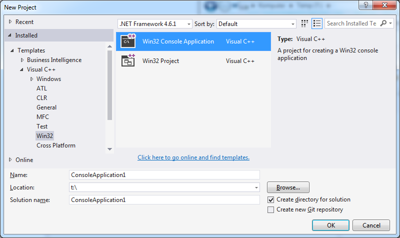
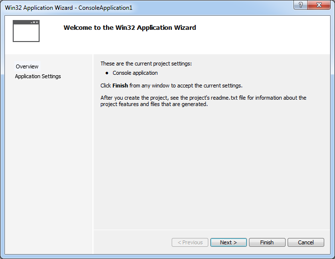
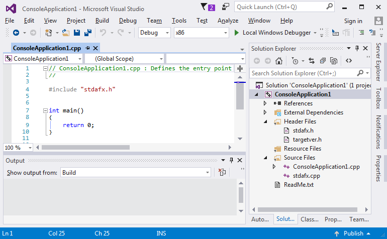
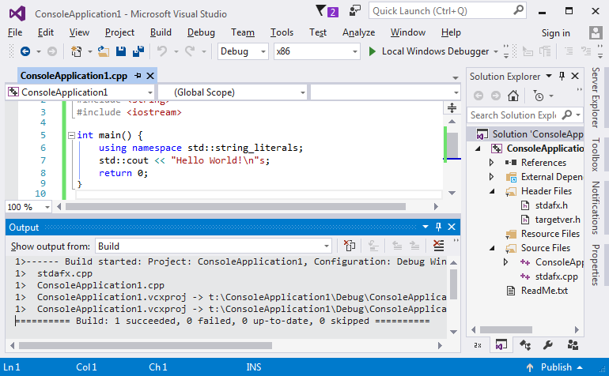

# Hello world

## Coliru

Prawie wszystkie kody z kursu dostępne są też na platformie Coliru. Programy można edytować, kompilować (gcc albo clang), uruchamiać z przeglądarki, nie jest potrzebny lokalnie zainstalowany kompilator. Coliru używa potężnego edytora ace [(spis skrótów klawiaturowych)](https://github.com/ajaxorg/ace/wiki/Default-Keyboard-Shortcuts).

Kod [Hello world]((http://coliru.stacked-crooked.com/a/be1a932a974e7b6f) na Coliru.

## Najprostszy program

Stałą praktyką w nauczaniu tworzenia oprogramowania jest demonstracja najprostszego programu w danym języku tak, aby można było jak najszybciej do teorii dołączyć umiejętności praktyczne.

Podobny opis [zamieścił Microsoft](https://www.visualstudio.com/vs/support/#!articles/816-6458-hello-world-in-c-using-visual-studio-2015).

## Reset Visual Studio

Na wszelki wypadek, gdy eksperymenty z Visual Studio zabrną za daleko, warto wspomnieć o:

- Przywrócenie standardowych ustawień okienek:
> Menu: Window » Reset Window Layout
- Przywrócenie defaultowych ustawień wszystkich opcji:
> Menu: Tools » Import and Export Settings » Reset all settings

## Nowy projekt:
> Skrót: Ctrl-Shift-N
> Menu: File » New » Project
> > Rodzaj projektu: Templates » Visual C++ » Win32
> > Szablon projektu: Win32 Console Application



---

Ten typ projektu nie ma zbyt wielu parametrów, standardowe wartości są bardzo dobre. Można wybrać "Finish".



## Projekt "Hello world"

Najprostszy projekt w w Visual Studio w C++ wygląda tak:



Minimalne wymagania wobec komputera dla VS mówią o karcie graficznej co najmniej 1024×768, GitBook skaluje obrazki do szerokości max. 770px, to wygląda jak wygląda :(

Program robi nic, należy go zastąpić kodem:
```C++
#include "stdafx.h"
#include <string>
#include <iostream>

int main() {
	using namespace std::string_literals;
	std::cout << "Hello World!\n"s;
	return 0;
}
```
Ten kod:
* Powinien wypisać na konsoli napis "Hello World!" i przejść do nowej linii.
* Jest napisany w czystym C++.
* Wymaga kompilatora co najmniej C++14.
* Dla purystów: tu jest jeden błąd, mało istotny (tak, są sytuacje, kiedy wykonanie programu nie powiedzie się).

## Kompilacja

Stale powtarzaną czynnością (Visual Studio) jest budowanie projektu (na razie niech wystarczy: przetworzenie napisanego kodu na kod binarny).
> Skrót: Ctrl-Shift-B
> Skrót: F7 (zależnie od ustawień VS)
> Menu: Build » Build Solution
> Menu kontekstowe w Solution Explorer: Build Solution

W logu w oknie "Output" powinien się pojawić opis "gdzie powstał program":
> ConsoleApplication1.vcxproj -> t:\ConsoleApplication1\Debug\ConsoleApplication1.exe

oraz podsumowanie procesu:
> ========== Build: 1 succeeded, 0 failed, 0 up-to-date, 0 skipped ==========



## Uruchomienie

Program można uruchomić korzystając z debuggera. Debugger to potężne narzędzie, pozwala na kontrolowane wykonania programu (linia po linii, zaglądając do ciała funkcji, z ustawianiem punktów przerwania), monitorowaniem stanu (podglądanie i zmiana zwartości obiektów), lokalnie albo zdalnie na innym komputerze, z możliwością "podłączenia się" do działającego procesu i dziesiątkami innych funkcji.

W ostatniej linii kodu ```}``` należy ustawić punkt przerwania (czerwony znacznik na marginesie)
> Skrót: F9
> Menu: Debug » Toggle Breakpoint
> Menu kontekstowe w Edytorze: Breakpoint » Insert Breakpoint

i uruchomić program - będzie się wykonywać do końca albo do punktu przerwania:
> Skrót: F5
> Menu: Debug » Start Debugging


### Zakończenie działania programu

* Eleganckie (niech wykona się do końca):
> Skrót: F5
> Menu: Debug » Continue

* Brutalne (po prostu koniec):
> Skrót: Shift-F5
> Menu: Debug » Stop Debugging

## O czym był ten program?

Aby nie pozostawiać niedomówień opiszę tych kilka linii. Temat z każdego zdania zostanie wkrótce omówiony, teraz może być czarną magią:

* ```#include "stdafx.h"```
   Wykorzystanie wstępnie kompliowanych nagłówków. Pliki nagłówkowe to jeden z bardziej nieudanych elementów języka, będzie usprawniony przez moduły (wprowadzone w C++17). Wstępnie kompilowane nagłówki (precompiled headers) znakomicie przyspieszają proces kompilacji, zostały wprowadzone w każdym szanującym się kompilatorze, w każdym inaczej. Tu: wersja Visual Studio.
* ```#include <string>```
   Włączenie wsparcia dla klasy ```std::string``` - chodzi o to, żeby kompilator rozumiał napisy.
* ```#include <iostream>```
   Włączenie wsparcia dla operacji wejścia/wyjścia na strumieniach - niech nasz program potrafi coś napisać na konsoli.
* ```<pusta linia>```
  C++ w zasadzie nie zwraca uwagi na formatowanie. Formatowanie ma sprzyjać czytelności kodu. Kompilator (zazwyczaj) puste linie po prostu ignoruje.
* ```int main() {```
  Tu jest dużo treści:
  * Program definiuje funkcję ```main```. Funkcja nie ma argumentów - puste nawiasy ```main()``` i zwraca wynik: liczba całkowita ze ze znakiem ```int```.
  * Otwierający nawias klamrowy ```{``` oznacza, że w kolejnych liniach będzie definiowana treść funkcji.
  * Przyjęło się (to jest konwencja, a nie definicja języka), że jeżeli program jest uruchamiany przez system operacyjny (Windows, Linux, Unix, etc.), to zaczyna od funkcji main.
* ```using namespace std::string_literals;```
   * Formalnie: w ramach funkcji ```main()``` wprowadzamy operator ```""s``` na literałach tekstowych (literały to wartości zapisane literalnie, na przykład 1500, 3.14 albo "Hello World!\n"). Chodzi o to, aby w kolejnej linii napis "CosTam"s (z 's' na końcu) został potraktowany jako obiekt klasy ```std::string``` a nie jak starożytna tablica znaków, rodem z języka C.
* ```std::cout << "Hello World!\n"s;```
   * Na standardowym strumieniu wyjściowym, zazwyczaj związanym z konsolą (```std::cout```) powinien pojawić się napis "Hello World!\n".
   * ```"Hello World!\n"s``` jest obiektem klasy ```std::string```
   * ```"\n"``` jest interpretowany jako znak przejścia do nowej linii.
   * ```<<``` jest operatorem. Takim jak plus czy minus.
* ```return 0;```
   * ```return``` oznacza zakończenie działania funkcji, w tym wypadku funkcji main().
   * ```return 0;``` zwraca wynik funkcji ```0``` (literał). Typ wyniku jest zgodny z deklaracją typu funkcji ```int main()```
   * (konwencja) wartość ```0``` zwrócona systemowi operacyjnymi oznacza "wszystko ok".
* ```}```
   Domknięcie nawiasu klamrowego (z linii ```int main() {```). Bo nawiasy muszą się zgadzać.
