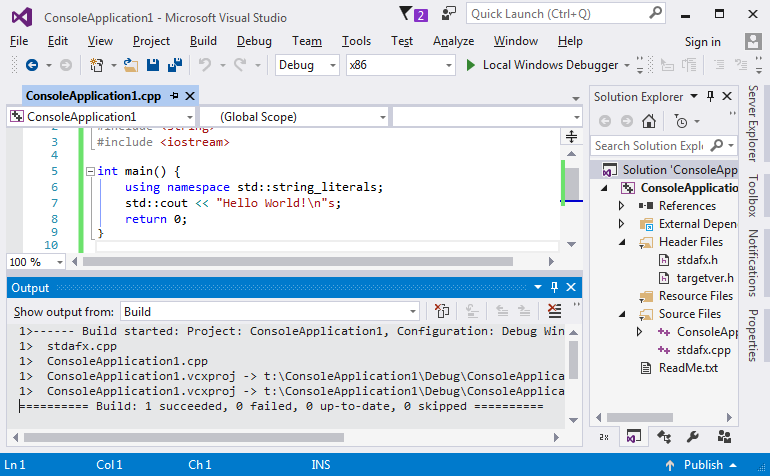
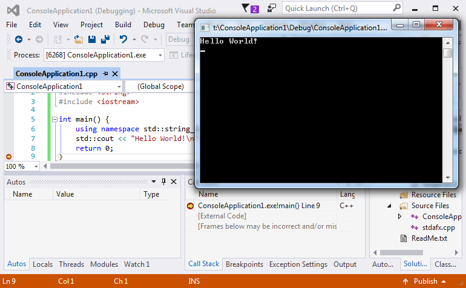

# Hello world #1

## Coliru

Prawie wszystkie kody z kursu dostępne są też na platformie Coliru. Programy można edytować, kompilować (gcc albo clang), uruchamiać z przeglądarki, nie jest potrzebny lokalnie zainstalowany kompilator. Coliru używa potężnego edytora ace [(spis skrótów klawiaturowych)](https://github.com/ajaxorg/ace/wiki/Default-Keyboard-Shortcuts).

Kod [Hello world #1]((http://coliru.stacked-crooked.com/a/be1a932a974e7b6f) jest dostępny na Coliru.

## Najprostszy program

Stałą praktyką w nauczaniu tworzenia oprogramowania jest demonstracja najprostszego programu w danym języku tak, aby można było jak najszybciej do teorii dołączyć umiejętności praktyczne.

Podobny manual [zamieścił Microsoft](https://www.visualstudio.com/vs/support/#!articles/816-6458-hello-world-in-c-using-visual-studio-2015).

## Reset Visual Studio

Na wszelki wypadek, gdy eksperymenty z Visual Studio zabrną za daleko, warto wspomnieć o:

- Przywrócenie standardowych ustawień okienek:
> Menu: Window » Reset Window Layout
- Przywrócenie defaultowych ustawień wszystkich opcji:
> Menu: Tools » Import and Export settings » Reset all settings

## Nowy projekt:
> Skrót: Ctrl-Shift-N  
> Menu: File » New » Project
> > Rodzaj projektu: Templates » Wisual C++ » Win32  
> > Szablon projektu: Win32 Console Application


---

Ten typ projektu nie ma zbyt wielu parametrów, standardowe wartości są bardzo dobre. Można wybrać "Finish".


## Projekt "Hello world"

Najprostszy projekt w w Visual Studio w C++ wygląda tak:


Minimalne wymagania wobec komputera dla VS mówią o karcie graficznej co najmniej 1024×768, GitBook skaluje obrazki do szerokości max. 770px, to wygląda jak wygląda :(

Program robi nic, należy go zastąpić kodem:
```C++
#include "stdafx.h"
#include <string>
#include <iostream>

int main() {
	using namespace std::string_literals;
	std::cout << "Hello World!\n"s;
	return 0;
}
```
Ten kod:
* Powinien wypisać na konsoli napis "Hello World!" i przejść do nowej linii.
* Jest napisany w czystym C++.
* Wymaga kompilatora co najmniej C++14.
* Dla purystów: tu jest jeden błąd, mało istotny (tak, są sytuacje, kiedy wykonanie programu nie powiedzie się).

## Kompilacja

Stale powtarzaną czynnością (C++) jest kompilowanie (przetworzenie napisanego kodu na kod binarny).
> Skrót: Ctrl-Shift-B  
> Skrót: F7 (zależnie od ustawień VS)  
> Menu: Build » Build Solution  
> Menu kontekstowe w Solution Explorer: Build Solution

W logu w oknie "Output" powinien się pojawić opis "gdzie powstał program"
> ConsoleApplication1.vcxproj -> t:\ConsoleApplication1\Debug\ConsoleApplication1.exe

oraz podsumowanie procesu kompilacji:
> ========== Build: 1 succeeded, 0 failed, 0 up-to-date, 0 skipped ==========



## Uruchomienie

Teraz można program uruchomić korzystając z debuggera. Debugger (odpluskwiacz) to potężne narzędzie, pozwala na kontrolowane wykonanie programu (linia po linii, zaglądając do ciała funkcji, z ustawianieniem punktów przerwania), monitorowaniem stanu (podglądanie i zmiana zawrtości obiektów), lokalnie albo na innym komputerze, z możliwością "podłączenia się" do działającego procesu i dziesiątkami innych funkcji.

W ostatniej linii kodu ```}``` należy ustawić punkt przerwania (czerwony znacznik na marginesie)
> Skrót: F9  
> Menu: Debug » Toggle Breakpoint  
> Menu kontekstowe w Edytorze: Breakpoint » Insert Breakpoint

i uruchomić program - będzie się wykonywać do końca albo do punktu przerwania:
> Skrót: F5  
> Menu: Debug » Start Debugging



### Zakończenie działania programu

* Eleganckie (niech wykona się do końca)
> Skrót: F5  
> Menu: Debug » Continue

* Brutalne (po prostu koniec)
> Skrót: Shift-F5  
> Menu: Debug » Stop Debugging

---


