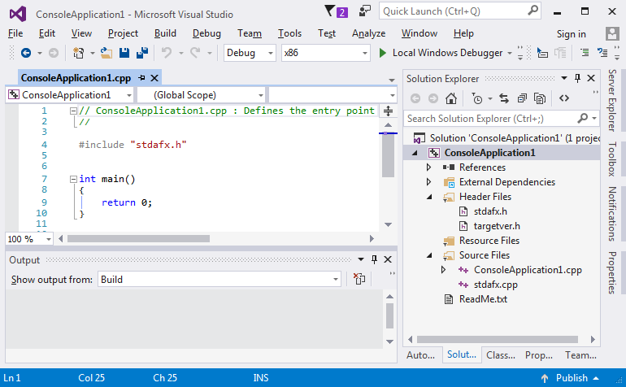

# Hello world #1

Stałą praktyką w nauczaniu tworzenia oprogramowania jest demonstracja najprostszego programu w danym języku, tak, aby można było jak najszybciej do teorii dołączyć umiejętności praktyczne.

Podobny manual [zamieścił Microsoft](https://www.visualstudio.com/vs/support/#!articles/816-6458-hello-world-in-c-using-visual-studio-2015).

Na wszelki wypadek, gdy eksperymenty z Visual Studio zabrną za daleko, warto wspomnieć o:

- Przywrócenie standardowych ustawień okienek:
> Menu: Window » Reset Window Layout
- Przywrócenie defaultowych ustawień wszystkich opcji:
> Menu: Tools » Import and Export settings » Reset all settings

---

Nowy projekt:
> Skrót: Ctrl-Shift-N  
> Menu: File » New » Project
> > Rodzaj projektu: Templates » Wisual C++ » Win32  
> > Szablon projektu: Win32 Console Application


---

Ten typ projektu nie ma zbyt wielu parametrów, standardowe wartości są bardzo dobre. Można wybrać "Finish".


---

Najprostszy projekt w C++ wygląda tak:



Minimalne wymagania wobec komputera dla VS mówią o karcie graficznej co najmniej 1024×768, GitBook skaluje obrazki do szerokości max. 770px, to wygląda jak wygląda :(

Program robi nic, należy go zastąpić kodem:
```C++
#include "stdafx.h"
#include <string>
#include <iostream>

int main() {
	using namespace std::string_literals;
	std::cout << "Hello World!\n"s;
	return 0;
}
```
Ten kod:
* Powinien wypisać na konsoli napis "Hello World!" i przejść do nowej linii.
* Jest napisany w czystym C++.
* Wymaga kompilatora co najmniej C++14.
* Dla purystów: tu jest jeden błąd, mało istotny (tak, są sytuacje, kiedy wykonanie programu nie powiedzie się).

---

Stale powtarzaną czynnością (C++) jest kompilowanie.
> Skrót: Ctrl-Shift-B  
> Skrót: F7 (zależnie od ustawień VS)  
> Menu: Build » Build Solution  
> Menu kontekstowe w Solution Explorer: Build Solution

