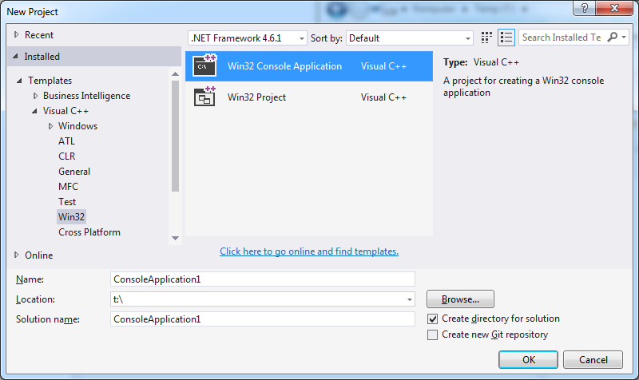

# Hello world #1

Stałą praktyką w nauczaniu tworzenia oprogramowania jest demonstracja najprostszego programu w danym języku, tak, aby można było jak najszybciej do teorii dołączyć umiejętności praktyczne.

Podobny manual [zamieścił Microsoft](https://www.visualstudio.com/vs/support/#!articles/816-6458-hello-world-in-c-using-visual-studio-2015).

Na wszelki wypadek, gdy eksperymenty z Visual Studio zabrną za daleko, warto wspomnieć o:

- Przywrócenie standardowych ustawień okienek:
> Menu: Window » Reset Window Layout
- Przywrócenie defaultowych ustawień wszystkich opcji:
> Menu: Tools » Import and Export settings » Reset all settings

---

Nowy projekt:
> Skrót: Ctrl-Shift-N
> Menu: File » New » Project
> > Rodzaj projektu: Templates » Wisual C++ » Win32
> > Szablon projektu: Win32 Console application

---

Ten typ projektu nie ma zbyt wiele parametrów, standardowe wartości są bardzo dobre. Można wybrać "Finish" (albo kilkukrotnie "Next")

---

Najprostszy projekt w C++ wygląda tak:
(minimalne wymagania wobec komputera dla VS mówią o karcie graficznej co najmniej 1024&times;768, GitBook skaluje obrazki do szerokości max. 770px, to wygląda jak wygląda)

